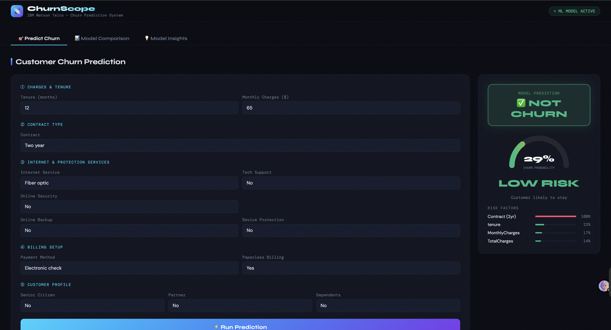
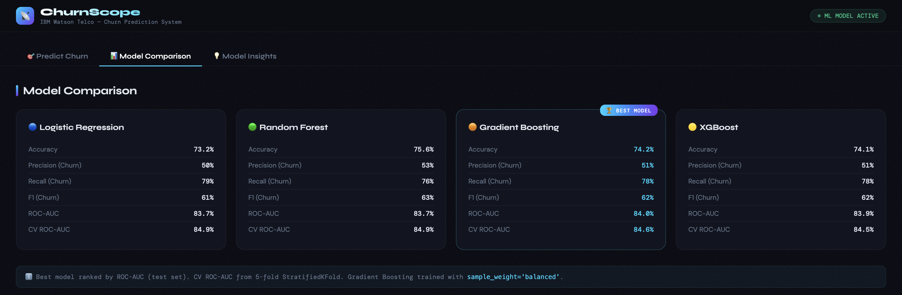
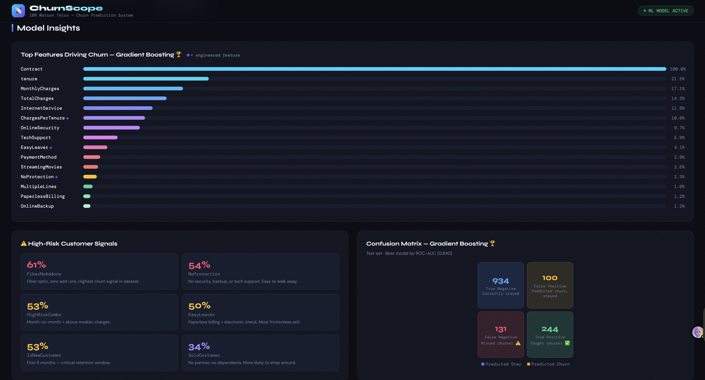

# ChurnScope — Telco Customer Churn Prediction

A full-stack machine learning web app that predicts customer churn probability in real time. Built on the IBM Watson Telco dataset (7,032 customers). The model trains automatically on first run — no manual setup required.



---

## What it does

Enter a customer's account details — contract type, tenure, charges, services — and the app returns:

- A churn probability score (0–100%)
- A risk classification: Low / Medium / High
- The top 4 risk factors driving that specific prediction, ranked by model feature importance

---

## Tech Stack

**Frontend** — Vanilla JS, HTML5, CSS3 (no frameworks)  
**Backend** — Node.js, Express  
**ML** — Python, scikit-learn (Gradient Boosting Classifier)  
**Security** — Helmet.js, CORS origin restriction, request size limiting  

---

## ML Pipeline

- **Dataset:** IBM Watson Telco Customer Churn — 7,043 records, 21 features
- **Model:** `GradientBoostingClassifier` with `sample_weight='balanced'` for class imbalance
- **Feature engineering:** 10 custom features on top of raw data — including `ChargesPerTenure`, `FiberNoAddons`, `HighRiskCombo`, `EasyLeaver`, and others derived from domain knowledge
- **Preprocessing:** `StandardScaler` for numerics, `OneHotEncoder` for categoricals via `ColumnTransformer`
- **Result:** 84.0% ROC-AUC on held-out test set

| Model | ROC-AUC | Recall (Churn) |
|---|---|---|
| Logistic Regression | 83.7% | 79% |
| Random Forest | 83.7% | 76% |
| **Gradient Boosting** 🏆 | **84.0%** | **78%** |
| XGBoost | 83.9% | 78% |



Gradient Boosting selected as the production model. Recall is prioritised — in churn prediction, a missed churner costs more than a false alarm.

---

## Key Engineering Decisions

- **Model trains on first request** — no manual training step. Server detects missing artifact on startup and trains in the background. Frontend polls `/api/model-status` and retries automatically when ready.
- **Feature importances saved in artifact** — risk factors shown to the user come directly from `model.feature_importances_`, not hardcoded values. Retraining updates the UI automatically.
- **CSP-compliant frontend** — no inline event handlers. All interactions use `addEventListener`, compatible with Helmet's strict Content Security Policy.



---

## Run Locally

```bash
# Install dependencies
npm install
pip install -r requirements.txt

# Start
npm start
# → http://localhost:3000
```

For development with auto-restart:
```bash
npm run dev
```

---

## Project Structure

```
├── backend/server.js        # Express API + model lifecycle
├── frontend/                # Vanilla JS/HTML/CSS
├── ml/
│   ├── train_model.py       # Feature engineering + training
│   ├── predict.py           # Inference
│   └── insights.py          # Serves feature importances
├── data/                    # IBM Watson Telco dataset
└── notebooks/               # EDA + model comparison
```

---

## Dataset

[IBM Watson Telco Customer Churn](https://www.kaggle.com/datasets/blastchar/telco-customer-churn) via Kaggle. 11 rows dropped due to missing `TotalCharges`. Final training set: 7,032 rows.